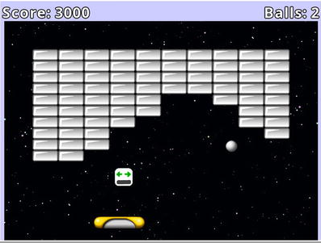

# Game: Rectangle Destroyer

Rectangle Destroyer is an action game in which the player controls a paddle that moves from side to side along 
the bottom of the screen and uses it to bounce a ball toward the rectangular brick-like objects above to destroy them.

## Setup

- **Java** 8
- **Gradle** Wrapper 6.7.1
- **LigGDX** 1.9.12: https://libgdx.badlogicgames.com
- Setup tool: https://github.com/tommyettinger/gdx-liftoff

## Disclaimer

This game is the result of reading, studying and learning the examples shown in the book "**Java Game Development with LibGDX**" by the author Lee Stemkoski.

- **Book site**: https://www.apress.com/gp/book/9781484233238
- **Source-code**: https://github.com/Apress/java-game-dev-LibGDX
